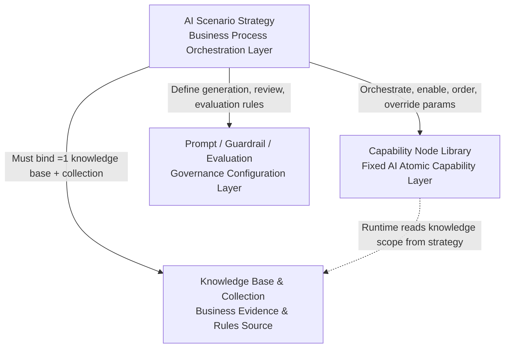

# AI CRM Service Hub

Online demo: [https://usago007.github.io/ai-crm-service-hub/](https://usago007.github.io/ai-crm-service-hub/)

A front-end workbench for customer service, CRM, and RAG-powered AI operations. Built with **React 19**, **TypeScript 6**, **Vite 8**, and **Tailwind CSS 4**. Driven entirely by mock API contracts and structured fixtures — no real backend, vector store, or model inference required to run.

## Target Scenarios

This project models the operational surface of an AI-assisted customer service platform. It is designed for teams prototyping or demonstrating:

- **AI-augmented customer service** — triage, retrieve, draft, review, and execute ticket replies with guardrail checks
- **RAG operations management** — configure parsing, chunking, embedding, retrieval, and prompt assembly pipelines
- **CRM & customer 360** — segment, risk-flag, and track complaint, refund, and fulfilment history per customer
- **Knowledge base operations** — ingest documents, manage ingestion jobs, run retrieval tests
- **Service health monitoring** — observe LLM, embedding, vector DB, connector, and ingestion queue status
- **Evaluation & feedback loops** — audit AI outputs, capture feedback, and iterate on model policies

## Core Features

### Customer Service Workbench
- Structured ticket workflow: `triage → retrieve → draft → review → execute → follow-up → resolved`
- AI-suggested replies with confidence scores, citations, and guardrail decisions
- Customer context panel: profile, order context, knowledge matches, risk review
- Conversation view with send guardrails and manual review routing

### AI Console
- **Global RAG Configuration** — parser (OCR, tables, headings), chunking (strategy, size, overlap), embedding (model, dimensions, index), retrieval (top-K, threshold, reranker, query rewrite), and prompt assembly (customer context, business rules, risk policies, blocked claims, output format)
- **Scenario Policy Configuration** — per-scenario knowledge scope, capability-node orchestration, model, retrieval, prompt, guardrail, and review policies
- **RAG Test Lab** — end-to-end retrieval debugging with chunk inspection, prompt preview, and guardrail simulation
- **Evaluation & Feedback** — score AI outputs, log issues, trigger improvement actions
- **Service Health Dashboard** — LLM status, embedding service, vector DB, external connectors, ingestion queue, diagnostics

### CRM & Customer 360
- Customer profiles with segment, region strategy, lifetime value, and risk flags
- Complaint and refund history tracking
- Promise fulfilment monitoring
- Recent service timeline (orders, tickets, reviews, RAG runs)

### Knowledge Base & Ingestion
- Knowledge base registry with document management
- Ingestion wizard: upload → parse → chunk → embed → index
- Per-document parser, chunking, and retrieval config overrides
- Ingestion job monitoring with stage status tracking

### Operations & Administration
- **Overview Dashboard** — key metrics, analytics, events, and shortcuts
- **Ticket Management** — filterable table with status, priority, SLA tracking
- **Order Management** — fulfilment status, payment status, carrier tracking
- **Follow-Up Tasks** — AI-triggered tasks with priority and owner assignment
- **Operation Logs** — system activity and AI audit trail
- **Settings** — team, permissions, channels, notifications

## Architecture

```text
src/
├── api/
│   ├── adapters/        mock API adapter
│   └── contracts/       request / response contracts
├── app/                 reserved app-level structure
├── entities/            shared entity exports
├── mocks/
│   └── fixtures/        structured case graph fixture snapshot
├── modules/             reserved module-level structure
├── pages/               page shells consuming app state
│   ├── ai-console/      AI console section (RAG config, test lab, evaluation, service health)
│   ├── CustomerService.tsx
│   ├── KnowledgeBase.tsx
│   ├── Customers.tsx
│   ├── Orders.tsx
│   ├── Tickets.tsx
│   ├── Overview.tsx
│   └── ...
├── shared/
│   ├── hooks/           app state + API orchestration
│   └── lib/             mapping helpers and policy engine
├── components/
│   ├── common/          reusable UI primitives (Button, Card, Modal, Toggle, DataTable, etc.)
│   ├── ai-ops/          AI-specific components (RAG test lab, capability pipeline)
│   ├── service/         customer service panels (conversation, customer context)
│   └── layout/          shell layout (sidebar, topbar, page chrome)
├── i18n/                localisation strings (en, zh)
├── types/               shared TypeScript type definitions
└── utils/               display helpers and formatting utilities
```

## AI Policy Model

The AI console follows one boundary rule: **capability nodes are fixed, knowledge bases are required, and scenario strategies orchestrate execution**.



### Terms

- **Scenario Strategy** — business-scenario workflow configuration for cases such as `Shipping`, `Refund`, `Product Inquiry`, `Payment`, `Complaint`, `Compensation`, and `Chargeback`. It binds a knowledge scope, orders fixed capability nodes, overrides node parameters, and defines prompt, guardrail, manual-review, and output rules.
- **Capability Node Library** — the fixed AI atomic capability layer, such as intent classification, knowledge retrieval, policy check, risk detection, reply drafting, and human review routing. Node definitions own default input/output, model, timeout, retry, fallback, citation, human-confirmation, dependency, required, and lock rules.
- **Knowledge Base & Collection** — the business evidence layer for FAQ, policy, SOP, rules, and standard replies. A strategy must bind at least one knowledge base and one collection before it can be saved.
- **PipelineNodeModelConfig** — compatibility configuration for the existing node editor. New UI display and validation prefer the extended capability-node definition fields, while keeping the compatibility fields available for older flows.

### Product Rules

- A scenario strategy cannot be saved without an effective `Knowledge Base + Collection` binding. Disabled knowledge bases do not participate in the effective knowledge scope, but their selected collections are preserved locally when re-enabled.
- Active strategies must enable the required capability nodes declared by node definitions. Current active-required nodes include `intent-classification`, `knowledge-retrieval`, and `reply-drafting`.
- Sensitive scenarios `Refund`, `Complaint`, `Compensation`, and `Chargeback` must enable `policy-check`, `risk-detection`, and `human-review-routing`.
- When `manualReviewRequired=true`, the UI automatically enables `human-review-routing`, locks its switch, and the mock API rejects any payload that omits it.
- The capability node library never binds concrete knowledge bases or collections. Strategy execution injects the selected knowledge collections into knowledge retrieval, policy check, reply drafting, and related runtime steps.
- The mock API repeats save-time validation and rejects illegal payloads. It does not silently downgrade an invalid `active` strategy to `draft`.

## Mock Data Rules

- Mock data lives exclusively in `src/mocks` and `src/api/adapters`
- Pages must not directly import legacy `src/data/*.ts`
- All data access goes through mock API contracts
- Mock fixtures cover success, failure, and conflict states

## Commands

```bash
npm install        # install dependencies
npm run dev        # start development server
npm run build      # type-check and production build
npm run lint       # run ESLint
npm run preview    # preview production build locally
```

## Build & Deployment

This project is deployed to GitHub Pages via a GitHub Actions workflow (`.github/workflows/deploy.yml`). On every push to `main`, the app is built and published automatically.

The live deployment is available at [https://usago007.github.io/ai-crm-service-hub/](https://usago007.github.io/ai-crm-service-hub/).

## Project Documentation

| File | Contents |
|------|----------|
| `AGENTS.md` | AI coding agent rules — read before making any code changes |
| `ARCHITECTURE.md` | Directory structure, data flow, ID reference map, known issues |
| `TASKS.md` | Known bugs, data integrity issues, refactoring tasks |
| `DECISIONS.md` | Architecture Decision Records (ADRs) |
| `SPEC.md` | Functional specifications and module boundaries |
| `MOCK_DATA.md` | Mock data reference, ID system, field semantics |
| `CLAUDE.md` | Claude Code execution guide |

## Notes

- Legacy `src/data/*.ts` and older components are preserved for incremental migration; the runtime uses the new snapshot + mock API architecture.
- This is a front-end-only project. API contracts and state flows are pre-wired for future integration with a real backend, vector store, and model inference services.
- The app uses React Query (`@tanstack/react-query`) for data fetching orchestration, with all state managed through the `useServiceHubApp` hook.
